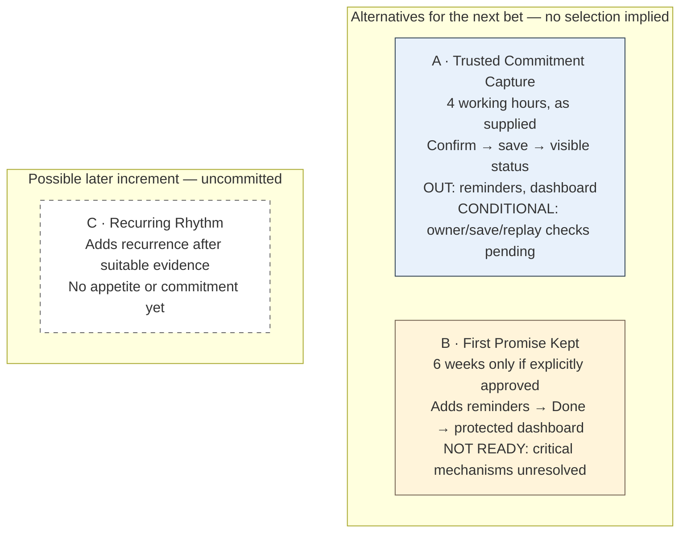
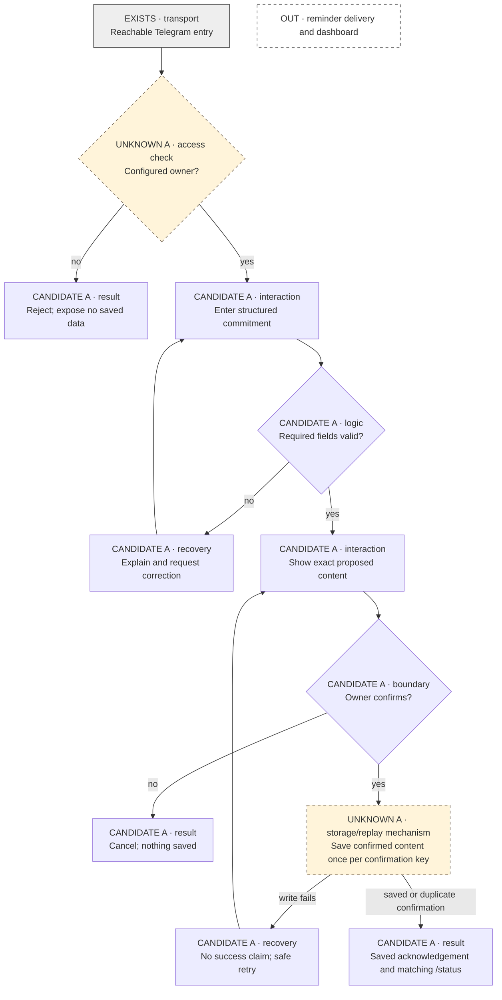
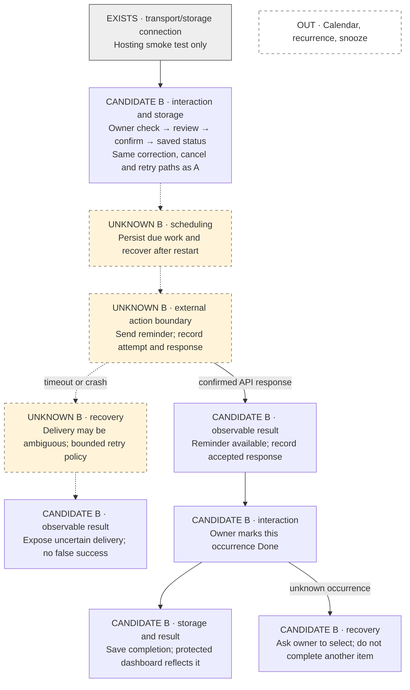

# Slice candidates (worked example): Shiori

This is an illustrative shaping conversation, not a report of completed implementation or
real production evidence. Shiori's vision is a Telegram assistant for capture, reminders
and follow-through, eventually including Calendar and a dashboard. All choices and evidence
below are **example assumptions** to show how to reason; a real pitch must cite actual files.

## Sources, appetite and learning

Suppose the builder says: “I have four working hours this afternoon, including verification.
I want to learn whether reviewing and saving a clear commitment is useful before adding
reminders.” One builder with an agent is available. The clock starts when execution begins;
earlier shaping is outside this example's allowance. That is the appetite to honor.

| Example source | Role | What it supports / does not establish |
| --- | --- | --- |
| `PRODUCT.md` §capture | Product intent | Owner can inspect a clear commitment; the whole follow-through vision is larger than this bet |
| Deployment spike report and smoke trace | Evidence, assumed for this example | A reachable Telegram entry and storage connection; no evidence of scheduling, delivery or duplicate protection |
| Whiteboard capture flow, v1 | Proposal | Review before save; must be confirmed as the intended interaction |
| Current code at inspected commit | Existing behavior, to verify | Only label reachable entry and storage connection EXISTS after inspection |
| `DESIGN.md` | Absent in this scenario | Not a blocker by itself; record owner isolation and confirmation as explicit constraints |

A hosting decision does not settle reminder semantics. If the product or an approved design
requires reminders in this release, surface that conflict before selecting capture-only;
do not quietly reinterpret the requirement.
[Set boundaries](https://basecamp.com/shapeup/1.2-chapter-03)

## Recommendation: A — Trusted Commitment Capture

Choose A **if** the capture hypothesis is the intended learning and its critical checks below
are supported. This is a deliberate useful bet: the owner can trust what was saved and find
it again. It does not test whether reminders improve follow-through. If four hours cannot
cover the protected behavior and verification, narrow further or stop; do not inflate the
appetite to six weeks.

B is an alternative when the builder instead wants to test the follow-through loop and
explicitly approves a larger investment. Six weeks is one possible appetite, not an inferred
default. C is only a possible later increment.

Text fallback: A and B are mutually exclusive choices for the next investment. B adds
reminder/completion/dashboard behavior and unresolved risk. C is outside both, uncommitted.

## A — experience and boundary

> In four working hours, let the configured owner review an explicit commitment, confirm
> its storage and retrieve the same saved content in `/status`.

- **Included:** configured owner only; a constrained structured capture command; review and
  confirmation; persistent save; visible `/status`; safe handling of duplicate confirmations;
  honest errors. Required layers: Telegram interaction, validation/confirmation logic,
  persistence and retrieval. No new dashboard layer is needed for this outcome.
- **No-gos:** reminder delivery, inferred intent, arbitrary natural-language dates, Calendar,
  recurrence, completion tracking, a web dashboard. Do not say “I'll remind you.”
- **Permissible cuts:** use a plain status list instead of grouped formatting. Keep capture
  structured instead of adding free-form parsing. These simplifications preserve the outcome.
- **Protected:** owner isolation, no save without confirmation, stored content matches the
  review, durable retrieval, no fake success on a failed write. These are not cuts.

Text fallback: entry → owner check → structured input → validation/correction → review →
confirm → save → matching status. Cancellation does not write; a failed save allows safe
retry; a duplicate confirmation returns the same record. Unauthorized callers see no data. Owner and save/replay mechanisms are labeled UNKNOWN
until the readiness evidence below supports these proposed behaviors.

### A readiness check

| Mechanism | Approach | Evidence needed / limit | Decision |
| --- | --- | --- | --- |
| Owner boundary | Check configured sender before reads/writes | Inspect an established access-check pattern or probe the sender-ID guard with owner/non-owner inputs; hosting alone does not establish it | Critical until supported |
| Confirm → save → status | Persist the reviewed payload; `/status` reads it | Existing durable-storage behavior or a tiny write/restart/read probe establishes feasibility; the actual conversation is verified during execution | Critical until supported |
| Replayed confirmation | Stable confirmation key + uniqueness enforced in storage | A small uniqueness/transaction probe or inspected proven implementation; validate that the key survives retries. Full command handling is built later | Critical until supported |

Readiness needs a credible mechanism with evidence proportionate to its risk, not the
finished feature. An established pattern or tiny throwaway probe can answer these questions;
there is no requirement to build A's entire conversation before selecting it. The UNKNOWN
labels describe missing mechanism evidence in this example, not merely unimplemented code.

A is a recommendation conditional on these checks, **not ready to commit merely because
hosting worked**. Inspect available implementation evidence first. If save/retry behavior is
unclear, run a targeted investigation or reshape; do not start the four-hour bet on a guess.
Unknown future scheduling mechanisms do not block A because reminders are explicitly out.

### A integrated verification and learning

On the approved test target: an unauthorized sender cannot read or write; owner submits a
structured commitment, corrects missing content, reviews and confirms, then sees identical
saved content in `/status` after a restart. Repeat confirmation: one stored commitment.
Cancel: no write. Inject write failure: no saved acknowledgement; retry safely succeeds.
Save the transcript and storage assertions at `evidence/shiori-A/`. Decomposition resolves
these steps to the actual test commands and target; no fictional runnable command is given.
A live-target mutation still needs the existing external-action authorization.

Functional success is distinct from learning: ask the owner to use capture/status for real
commitments and observe whether they return to inspect them. This tests the value hypothesis;
a green test suite alone does not establish usefulness.

## B — First Promise Kept (conditional alternative)

If the builder instead approves a six-week bet to investigate follow-through: explicit
one-off capture → confirmation → save/status → reminder → Done → protected minimal dashboard.
Keep A's access/confirmation/integrity requirements. Add persisted due work, recovery after
restart, delivery-attempt tracking, explicit timezone policy, occurrence-bound Done actions
and a dashboard reading the same state. Exclude recurrence, Calendar and snooze.
A possible cut is a plain dashboard without event-history browsing, provided current state
remains truthful. Permission, recovery behavior and truthful delivery status remain protected.

Text fallback: B includes A's owner/confirm/save/status flow and failure paths, then adds a
scheduler, external reminder attempt, occurrence-specific Done and protected live dashboard.
Scheduling and ambiguous-send recovery are UNKNOWN. A confirmed API response is not proof
that the owner read a message. Calendar, recurrence and snooze are excluded.

### B readiness and delivery claims

The hosting spike provides **no evidence** for restart-safe due work, timezone interpretation,
concurrent-worker duplicate protection or delivery after a crash between send and record.
Choose and test mechanisms before committing: a targeted spike should simulate restart,
duplicate triggers, concurrent claims, timeout and that ambiguous send/record window. Decide
whether bounded retries may duplicate a message or uncertain attempts require manual recovery,
and communicate that policy. Do not promise exactly-once external delivery without evidence
of a protocol that can provide it. Internal deduplication is a narrower, testable claim.

The integrated check must cover capture through Done and matching dashboard state, including
restart, duplicate triggers, ambiguous delivery status and wrong-occurrence recovery. Target
and commands must come from the selected implementation. B is **not ready to bet** while
these mechanisms are unresolved, regardless of its larger possible appetite.

## Selecting and decomposing A

If the human selects A after readiness is supported, save its boundary, source references,
A diagram and evidence table as `slice.md`, ID `shiori-A`, revision `1`, with actual approval
provenance. Preserve unresolved noncritical details honestly. Set `bet.appetite` to 4
working-hours with the accounting above; copy A's integrated check into `bet.verification`.
Do not copy B or C into the active story DAG.

An initial story can demonstrate structured input → confirmation → saved status on a test
target, labeled an **internal walking skeleton**. Later stories deepen failure handling and
verification. Every story has independent QA; the integrated bet check still covers the
full flow. If every story passes but `/status` reads stale data after restart, the bet has
failed its outcome check. Add an in-scope fix only if it fits remaining appetite; otherwise
stop. Do not change the durability requirement to make it pass.

Before/after each story record consumed and remaining working time. At the limit, checkpoint
unfinished code, evidence and questions; do not call that shipped or assume tomorrow is an
extension. If reminders are requested mid-run, record a future candidate or an explicitly
approved scope swap with its cuts and readiness rechecked. Finishing capture early means
inspect the result and learning, then choose another bet deliberately.
[The circuit breaker](https://basecamp.com/shapeup/2.2-chapter-08),
[Integrated early pieces](https://basecamp.com/shapeup/3.2-chapter-11)
