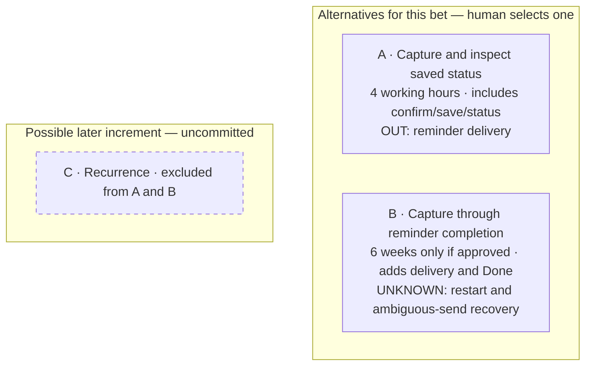
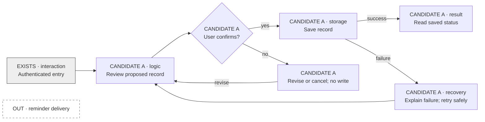

# Slice candidates: <product name>

*Options, not a backlog. Use as much detail as this decision needs; a small bet may fit in
a few paragraphs. Keep only the selected pitch fully detailed.*

## Sources and decision context

| Source / section / revision or date | Role (intent, constraint, evidence, proposal) | Supports / limits |
| --- | --- | --- |
| <PRODUCT.md or human ask> | <role> | <relevant outcome> |
| <available DESIGN.md, whiteboard, spike, code; omit irrelevant/missing artifacts> | <role> | <what it establishes, what remains unknown> |

- **Conflicts / missing decisions** — <none, or question and whose decision is needed>.
- **Appetite already supplied** — <limit, capacity, counting rule; approval reference or unknown>.
- **Intended learning** — <value hypothesis and the observation that would inform it>.
- **One bet or many?** — <what useful serving could fit; no need to build the whole vision>.
[Set boundaries](https://basecamp.com/shapeup/1.2-chapter-03)

## Recommendation and alternatives

| Candidate | Useful outcome | Appetite | Learning | Readiness / why first or later |
| --- | --- | --- | --- | --- |
| <name> | <result> | <actual limit or conditional> | <hypothesis> | <evidence / critical unknown> |

<Recommend based on appetite and learning; human selects. Future candidates are options.>

## Visual comparison (omit for text-only / deliberately tiny output)

Replace the example labels and remove irrelevant context. These are alternatives, not a
sequence. A potential later increment gets its own explicitly uncommitted group.

Text fallback: A and B are alternative investments; B adds reminder/completion mechanisms
and requires more evidence. C is an uncommitted future option, not part of either bet.

## Selected pitch: <ID — name>

*Status: <candidate / selected>. Revision: <version or commit>. Approval: <human + date +
message/decision reference, or pending>. Save to `slice.md` or cite this exact section and
revision at handoff. Other candidates are not authorized.*

> Within <appetite>, <user> can <useful end-to-end result>.

- **Problem / value hypothesis** — <pain, why this outcome is useful, intended learning>.
- **Appetite** — <human-approved investment limit and team/capacity; clock starts when;
  elapsed vs working-time accounting; whether shaping/spikes count; includes verification>.
- **Sources and constraints** — <relevant references from above, approved design constraints,
  resolved conflicts; keep product intent and selected scope consistent>.
- **Solution / user experience**
  1. <user action → mechanism → observable result>
  2. <…through a useful outcome>
- **Included** — <bounded scope>.
- **No-gos** — <excluded scope; no implied promise to do it later>.
- **Permissible cuts** — <simplifications preserving the outcome, or none>.
- **Protected requirements** — <essential quality, permissions, integrity, truthful claims>.
- **Rabbit holes** — <traps and mitigation>.

### Experience visual: <selected ID>

Copy the selected candidate's diagram here. Each serious candidate should have its own
small flow when presenting options. The sample below uses only layers needed for A; replace
it with the actual experience, including essential action boundaries and failure recovery.

Text fallback: authenticated entry → review → confirm → save → visible saved status;
cancel writes nothing; save failure is explained and can be retried. Reminders are out.
Only label entry EXISTS if evidence supports it; otherwise include it in candidate scope.
Use `UNKNOWN` labels/dashed paths for unresolved mechanisms. This diagram is the experience,
not the story execution graph. Keep it consistent with design constraints and the table below.

### Mechanisms and readiness

| Critical mechanism / requirement | Proposed approach | Evidence and limits | Unknown / disposition |
| --- | --- | --- | --- |
| <what must work> | <how, distinct from requirement> | <artifact/observation or none> | <ready / targeted spike / narrower scope> |

**Ready to bet?** <Yes with rationale, or no: critical question to resolve before commitment>.
Unknowns only in excluded future scope need not block this bet.
[Risks](https://basecamp.com/shapeup/1.4-chapter-05)

### Integrated outcome verification

<One re-runnable end-to-end flow, observable success and essential failure cases, exact
commands or manual steps, target environment and evidence path. Reuse story checks where
possible; green stories alone do not establish this result. State what user observation
will test the value hypothesis separately from functional verification.>

### Stop / reshape decisions

<Check remaining appetite before and after stories and when risks emerge. Use permitted
cuts while they still fit. Record human-approved scope swaps with what leaves as well as
what enters. Protect ACs and non-negotiables. At the limit stop, preserve code/evidence/open
questions and a checkpoint; further investment requires a fresh bet. Record actual
stop/reshape decisions here with date, reason and approval. No automatic extension.>
[The circuit breaker](https://basecamp.com/shapeup/2.2-chapter-08)

### Handoff

<`squad-decompose` reads this selected pitch, persists its reference/revision, approval,
appetite and integrated verification in `user-story.json`, and maps stories to its scope.
The first story may be an internal walking skeleton; label its demo honestly. Human approval
of the execution plan remains required. If finished early, inspect the outcome before
choosing another bet.>
